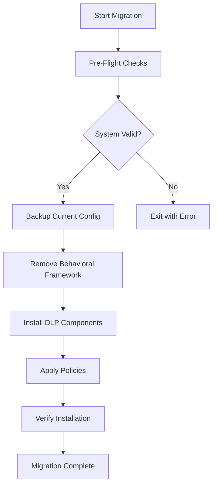

<div align="center">

# 🔐 Jamf DLP Migration

> **Automated migration tool for transitioning from Jamf Behavioral Framework to Jamf DLP**


[Features](#-features) • [Quick Start](#-quick-start) • [Configuration](#️-configuration) • [Contributing](#-contributing)

</div>

---


## ✨ Features

| Feature | Description |
|---------|-------------|
| 🔄 **Automated Migration** | One-click transition from Behavioral Framework to DLP |
| 🔍 **Pre-Flight Checks** | Validates system requirements before migration |
| 📊 **Progress Tracking** | Visual feedback during migration process |
| 🛡️ **Rollback Support** | Safe rollback if migration fails |
| 📝 **Detailed Logging** | Comprehensive logs for troubleshooting |
| 🔐 **Policy Preservation** | Maintains existing security policies |

---

## 📋 Prerequisites

| Requirement | Version |
|-------------|---------|
| macOS | 11.0+ |
| Jamf Pro | 10.35+ |
| Behavioral Framework | Installed |
| Admin Rights | Required |

---

## 🚀 Quick Start

### 1. Clone the Repository

```bash
git clone https://github.com/CaputoDavide93/Jamf-DLP-Migration.git
cd Jamf-DLP-Migration
```

### 2. Make Script Executable

```bash
chmod +x migrate_to_dlp.sh
```

### 3. Run Migration

```bash
sudo ./migrate_to_dlp.sh
```

---

## ⚙️ Configuration

### Environment Variables

| Variable | Description | Default |
|----------|-------------|---------|
| `JAMF_URL` | Jamf Pro server URL | - |
| `DLP_PROFILE_ID` | DLP configuration profile ID | - |
| `LOG_LEVEL` | Logging verbosity | `INFO` |
| `DRY_RUN` | Test mode without changes | `false` |

### Example Configuration

```bash
export JAMF_URL="https://your-jamf.jamfcloud.com"
export DLP_PROFILE_ID="123"
export LOG_LEVEL="DEBUG"
```

---

## 📖 Usage

### Basic Migration

```bash
sudo ./migrate_to_dlp.sh
```

### Dry Run (Test Mode)

```bash
DRY_RUN=true sudo ./migrate_to_dlp.sh
```

### With Verbose Logging

```bash
LOG_LEVEL=DEBUG sudo ./migrate_to_dlp.sh
```

---

## 🔧 How It Works



### Migration Steps

1. **Pre-Flight Checks** - Validates macOS version, Jamf enrollment, and admin rights
2. **Configuration Backup** - Creates backup of current Behavioral Framework settings
3. **Framework Removal** - Safely removes Behavioral Framework components
4. **DLP Installation** - Installs and configures Jamf DLP
5. **Policy Migration** - Transfers existing policies to DLP format
6. **Verification** - Confirms successful installation

---

## 🐛 Troubleshooting

### Common Issues

<details>
<summary>❌ Permission Denied</summary>

```bash
# Solution: Run with sudo
sudo ./migrate_to_dlp.sh
```
</details>

<details>
<summary>❌ Jamf Not Enrolled</summary>

```bash
# Verify Jamf enrollment
sudo jamf policy
```
</details>

<details>
<summary>❌ Migration Failed</summary>

```bash
# Check logs
cat /var/log/jamf_dlp_migration.log

# Rollback if needed
sudo ./migrate_to_dlp.sh --rollback
```
</details>

### Log Locations

| Log | Path |
|-----|------|
| Migration Log | `/var/log/jamf_dlp_migration.log` |
| Jamf Log | `/var/log/jamf.log` |

---

## 🤝 Contributing

Contributions are welcome! Please see [CONTRIBUTING.md](CONTRIBUTING.md) for guidelines.

1. Fork the repository
2. Create a feature branch (`git checkout -b feature/amazing-feature`)
3. Commit changes (`git commit -m 'Add amazing feature'`)
4. Push to branch (`git push origin feature/amazing-feature`)
5. Open a Pull Request

---

## 📄 License

This project is licensed under the MIT License - see the [LICENSE](LICENSE) file for details.

---

<div align="center">

## 👤 Author

**Davide Caputo**

[](https://github.com/CaputoDavide93)
[](mailto:CaputoDav@gmail.com)

---

⭐ **If this tool helped you, please give it a star!** ⭐

</div>
