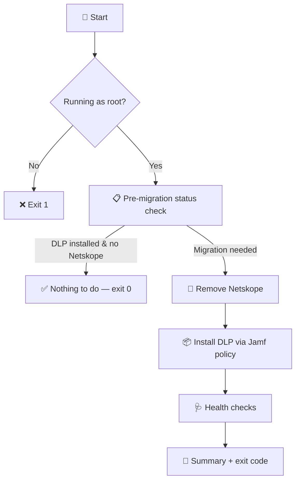

<div align="center">

# 🔐 Jamf DLP Migration

**Jamf-deployed script that removes Netskope from macOS and installs your target DLP solution in its place**


[Features](#-features) • [Quick Start](#-quick-start) • [Configuration](#️-configuration) • [Contributing](#-contributing)

</div>

---

> ⚠️ **Destructive migration — there is NO automatic rollback.**
> This script permanently kills Netskope processes, unloads its launchd items and kernel extensions, deletes its files, preferences, and package receipts for every user, and disables its proxy/DNS configuration. It takes **no backup** and has **no restore or `--rollback` mode**.
> **Test on a single machine first**, and have a Jamf policy / MDM re-scoping ready to reinstall Netskope if you need to back out.

---

## ✨ Features

| | Feature | What it does |
|---|---------|--------------|
| 🔍 | **Netskope detection** | Finds Netskope via filesystem paths and `pkgutil` package receipts |
| 🧹 | **Complete removal** | Kills processes, unloads launchd items and kexts, deletes apps, support files, preferences, and receipts for every user |
| 🌐 | **Network cleanup** | Disables Netskope web/secure/PAC proxies, removes its DNS resolver files, flags VPN configs for manual removal |
| 📦 | **DLP install via Jamf** | Runs `jamf recon` + `jamf manage`, then `jamf policy -id <ID>`, and verifies the DLP appears on disk |
| ♻️ | **Idempotent** | Exits 0 immediately when the DLP is already installed and Netskope is gone |
| 🩺 | **Health checks** | Five post-migration checks: removal, install, leftover processes, disk usage, launchd leftovers |
| 📝 | **Logging** | Timestamped, level-filtered (DEBUG→ERROR) output to stdout — the Jamf policy log captures it — plus an end-of-run error/warning summary |
| 🚧 | **Non-blocking errors** | Removal/install failures are logged and the run continues to the summary instead of dying mid-migration |

---

## 📋 Prerequisites

| Requirement | Notes |
|-------------|-------|
| macOS device enrolled in Jamf Pro | The `jamf` binary must be available |
| A Jamf policy that installs your DLP | Referenced by policy ID (script parameter `$4`) |
| Root / sudo | The script exits immediately without it |
| Bash 3.2+ | Compatible with the macOS system Bash |

---

## 🚀 Quick Start

> ⚠️ **Important:** Before running, you MUST customize the script for your DLP solution — see below.

### 1. Clone the Repository

```bash
git clone https://github.com/CaputoDavide93/Jamf-DLP-Migration.git
cd Jamf-DLP-Migration
```

### 2. Customize for Your DLP Solution

Edit `migrate_to_dlp.sh` and update these placeholder values:

```bash
# DLP paths - CUSTOMIZE THESE FOR YOUR DLP SOLUTION
DLP_PATHS=(
    "/Applications/YourDLP.app"        # ← Change to your DLP app path
    "/Library/Application Support/YourDLP"  # ← Change to your DLP support path
)

# Package identifiers for receipt checking
DLP_PKGS=("yourdlp" "com.yourdlp")     # ← Change to your DLP package IDs
```

These are how the script decides whether the DLP is installed — if they don't
match your product, installation verification will always fail.

### 3. Deploy via Jamf (recommended)

Upload the script to Jamf Pro and scope it as a policy, setting:

- **Parameter 4** — the policy ID that installs your DLP (default: `269`)
- **Parameter 5** — log verbosity: `DEBUG`, `INFO`, `WARN`, or `ERROR` (default: `INFO`)

### 4. Or Run Manually on a Test Machine

```bash
chmod +x migrate_to_dlp.sh
# Args 1-3 are Jamf's mount-point/computer/user placeholders - pass empty strings
sudo ./migrate_to_dlp.sh "" "" "" 269 DEBUG
```

---

## ⚙️ Configuration

### Jamf Script Parameters

| Parameter | Description | Default |
|-----------|-------------|---------|
| `$4` | Jamf policy ID that installs the target DLP | `269` |
| `$5` | Log verbosity (`DEBUG`, `INFO`, `WARN`, `ERROR`) | `INFO` |

### In-Script Settings

| Variable | Description | Default |
|----------|-------------|---------|
| `DLP_PATHS` / `DLP_PKGS` | How the target DLP is detected — **customize these** | placeholders |
| `NETSKOPE_PATHS` / `NETSKOPE_PKGS` | How Netskope is detected | Netskope defaults |
| `MAX_WAIT_REMOVAL` | Seconds to wait for removal to verify | `60` |
| `MAX_WAIT_INSTALL` | Seconds to wait for the DLP install to verify | `90` |
| `CHECK_INTERVAL` | Seconds between verification checks | `3` |

There are no environment variables and no dry-run mode — the script acts as
soon as it runs.

---

## 🔧 How It Works


```mermaid
graph TD
    A[🚀 Start] --> B{Running as root?}
    B -->|No| X[❌ Exit 1]
    B -->|Yes| C[📋 Pre-migration status check]
    C -->|DLP installed & no Netskope| Z[✅ Nothing to do — exit 0]
    C -->|Migration needed| D[🧹 Remove Netskope]
    D --> E[📦 Install DLP via Jamf policy]
    E --> F[🩺 Health checks]
    F --> G[📝 Summary + exit code]
```

### Migration Steps

1. **Pre-flight** — requires root, logs system info (macOS, console user, Jamf version), and checks the current Netskope/DLP state; exits early if nothing to do
2. **Stop processes** — `pkill -9` on all Netskope processes
3. **Unload launchd items** — system daemons and agents
4. **Unload kernel extensions** — unloads and deletes Netskope kexts, rebuilds the kext cache (may require reboot)
5. **System extensions** — detects them and warns; macOS requires manual removal or a reboot for these
6. **File cleanup** — apps, support files, launchd plists, system and per-user preferences, caches, saved state, and logs
7. **Network cleanup** — disables Netskope web/secure/PAC proxies, removes its `/etc/resolver` files, flags VPN configs for manual removal
8. **Forget receipts** — `pkgutil --forget` for all Netskope package IDs, then re-verifies removal (up to 60 s)
9. **Install DLP** — `jamf recon`, `jamf manage`, then `jamf policy -id <ID>`, verifying the DLP appears on disk (up to 90 s)
10. **Health check & summary** — five checks, error/warning recap, final status

### Exit Codes

| Code | Meaning |
|------|---------|
| `0` | DLP installed (including "already in desired state" and "installed but Netskope remnants remain") |
| `1` | DLP installation failed — manual intervention required |

---

## 🐛 Troubleshooting

### Common Issues

<details>
<summary>❌ "This script must be run as root or with sudo"</summary>

```bash
sudo ./migrate_to_dlp.sh "" "" "" 269 INFO
```
</details>

<details>
<summary>❌ Jamf Not Enrolled / policy fails</summary>

```bash
# Verify Jamf enrollment and connectivity
sudo jamf policy

# Verify the DLP install policy ID passed as parameter 4 exists and is scoped
```
</details>

<details>
<summary>⚠ Netskope remnants still detected</summary>

System/network extensions and VPN configurations can survive the cleanup —
macOS requires user approval or a reboot to remove them:

- Reboot the machine, then re-run the script (it is idempotent)
- Check **System Settings → Privacy & Security → Extensions** and
  **System Settings → Network → VPN** for leftovers
</details>

<details>
<summary>❌ "DLP not detected" after the policy ran</summary>

The script verifies the install against `DLP_PATHS` and `DLP_PKGS`. If those
placeholders were not customized to your actual DLP product, verification
always fails even when the install succeeded.
</details>

### Log Locations

All script output goes to **stdout**, so Jamf captures it in the policy
execution log (Jamf Pro → the policy → Logs). No local log file is written.

| Log | Path |
|-----|------|
| Script output (Jamf deployment) | Jamf Pro policy log for the machine |
| Script output (manual run) | Your terminal — `sudo ./migrate_to_dlp.sh ... 2>&1 \| tee migration.log` |
| Jamf client log | `/var/log/jamf.log` |

---

## 🤝 Contributing

Contributions are welcome! Please see [CONTRIBUTING.md](CONTRIBUTING.md) for guidelines.

1. Fork the repository
2. Create a feature branch (`git checkout -b feature/amazing-feature`)
3. Commit changes (`git commit -m 'Add amazing feature'`)
4. Push to branch (`git push origin feature/amazing-feature`)
5. Open a Pull Request

---

## 📄 License

This project is licensed under the MIT License - see the [LICENSE](LICENSE) file for details.

---

<div align="center">

## 👤 Author

**Davide Caputo**

[](https://github.com/CaputoDavide93)

---

⭐ **If this tool helped you, please give it a star!** ⭐

<sub>Made with ❤️ by Davide Caputo</sub>

</div>
